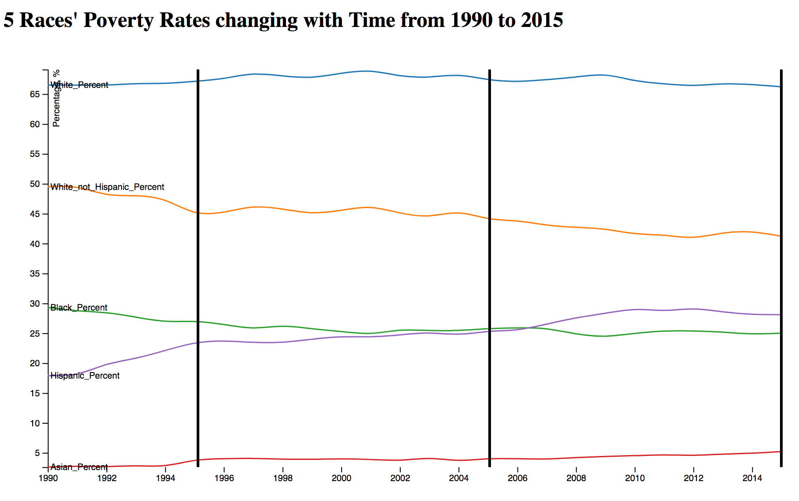
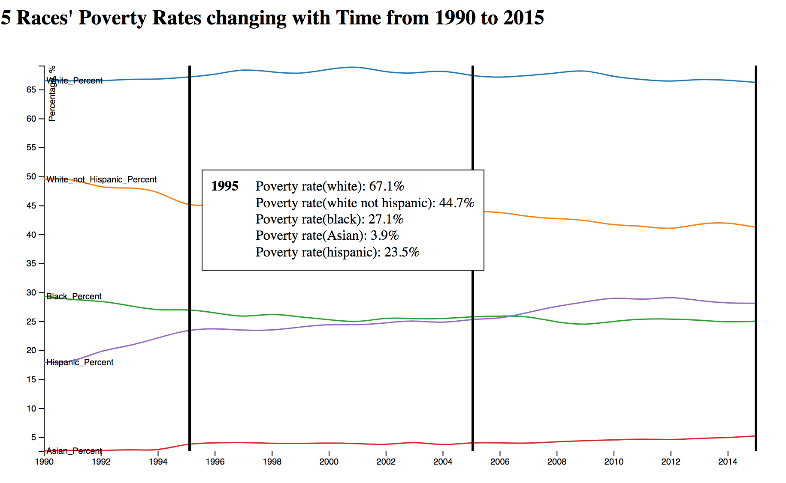
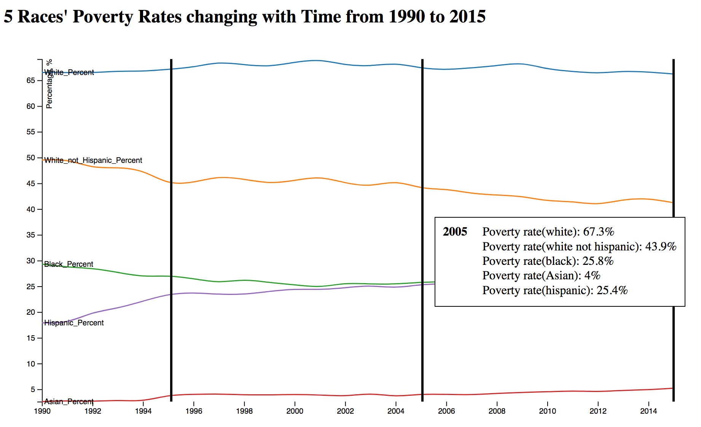
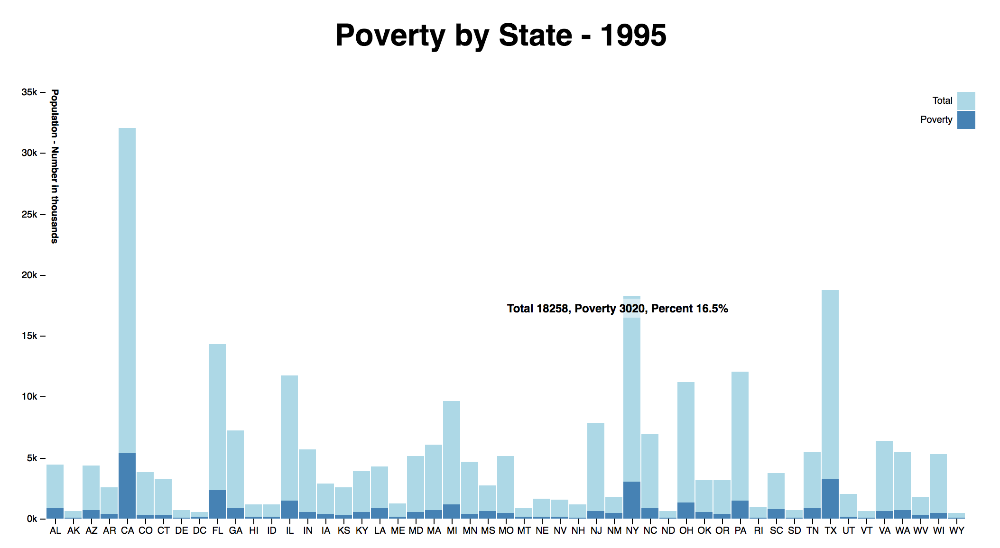
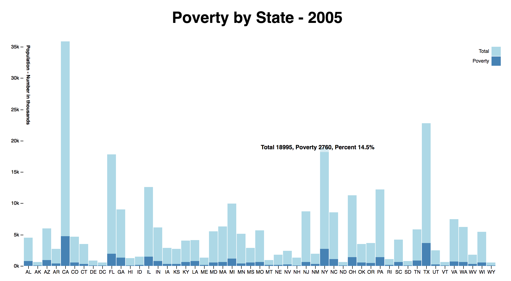
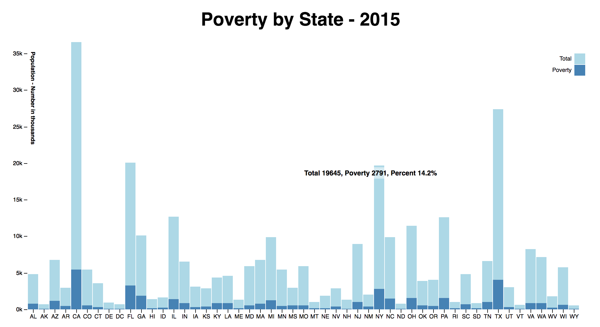
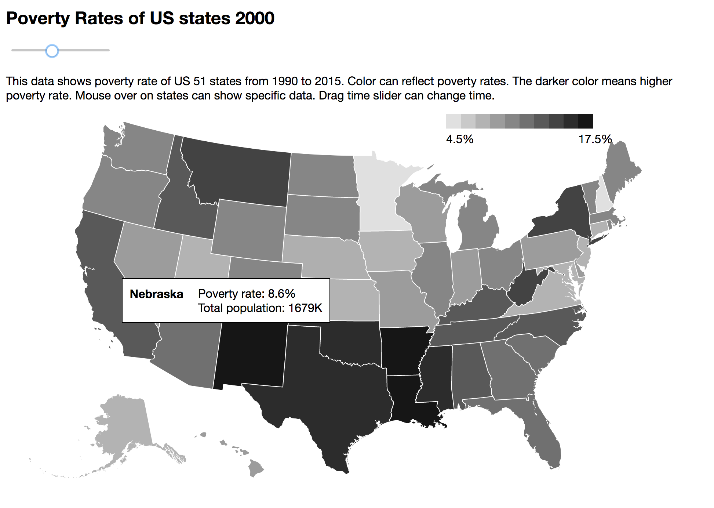
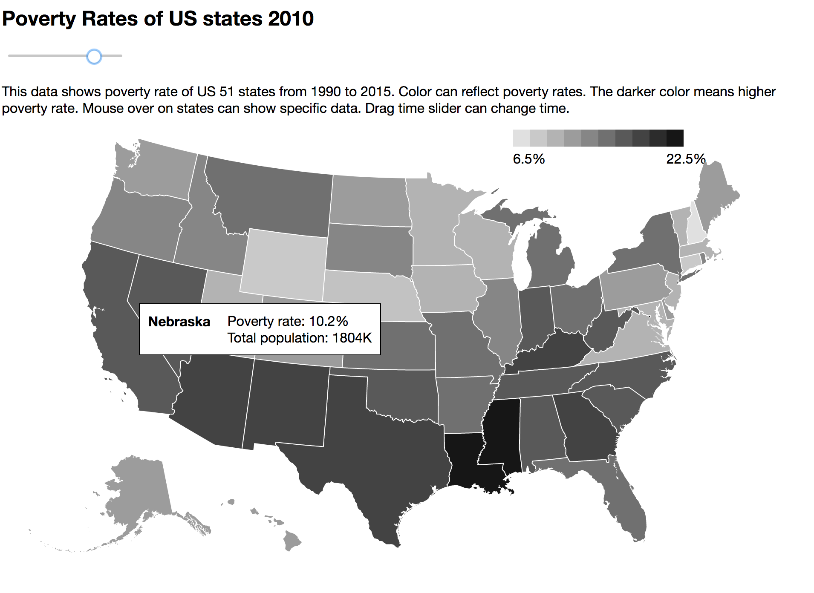
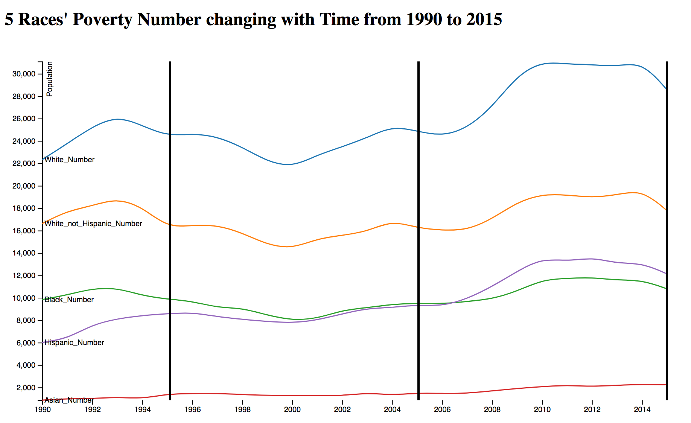

# INFSCI 2415 Information Visualization
## Report of Homework 1: Generate Visualizations to Compare the Poverty Data by States, by Races, and by Time

### Team Member and Contribution:

He, Jiexiao jih102@pitt.edu  
Song, Chen chs222@pitt.edu  
Xie, Jingran jix73@pitt.edu  

Jiexiao completed the first visualization: a time-series plot to show how the poverty by race change from 1990 to 2015. Chen did the data preprocessing, drafted the report and completed the second visualization: three bar charts corresponding to poverty of the states in 1995, 2005, and 2015. Jingran completed the third visualization: how the data change between 1990 and 2015, by state and by race. We discussed the methods to preprocess the data and design the visualizations together.

### Exploration and Preprocessing of the Dataset:

There are two datasets: D1 is Distribution of the Poor by Race and Hispanic Origin, D2 is Number of Poor and Poverty Rate by State. After some exploration of the two datasets, we found two things we need to deal with before we start:  

1. Measurement of poverty changed in 2013, therefore in both the two datasets, there are two rows can be mapped to 2013, each one holds a method of measurement. To deal with this problem, we took the average of the two rows as the final data element of 2013. We believe the average method can smooth the data from one measurement method to the other.  

2. Method in survey about race identification changed between 2001 and 2002. Before that people can only chose one race identification; after that people can chose one or a combination of race identifications. This change created a lot of NAs in D1. To omit the NAs, we decided to merge the data of a race before and after 2001 into a column together. The problem is, which column we should choose when we do the merge, [raceName] or [raceName only]. It is clear that the first one contains the people have multiple race identifications so there will be some overlaps, but the second one excludes the multiple race identifications people, so there will be some gaps. We prefer overlap than gap, so that we will not lose any information. Based on this, we decide to merge "white alone" and "white", "white alone not hispanic" and "white not hispanic", "black alone or in combination" and "black" (discard "black alone"), "Asian alone or in combination" and "Asian & Pacific islander" (discard "Asian alone"). We keep "hispanic". Since hispanic can be any race, this column contains overlap information naturally, which is consistent with previous merges. After this manipulate, we can avoid most NAs in D1.  

After dealing with these two crucial problems, we also did several other steps in data preprocessing. We deleted the titles, instructions and footnotes in the two tables, the rows before 1995 or after 2015 in both tables, as well as standard errors columns in D1, which we will not need in the visualization. In D2, we added a column of abbreviations of the states, which we can use in our visualization later. Also for D2, we split it into 26 tables, one year each table, for later use of time slider. Finally, we change all the tables into csv files. All these preprocessing steps were finished in Excel.  

### Visualization Design:

##### Visualization I: A time-series plot to show how the poverty by race change from 1990 to 2015

To display a group of time-series data, we have several of choices: index charts, stacked charts, small multiples, horizon graphs, etc. In D1 dataset, "Total" is the total number of people participant the survey and it changes over time. Since we have different bases for every year, the absolute values are not very useful to show the poverty by race change along time, so we decided to use percentage numbers in visualization. However, our race identifications contain overlaps, stacked charts may not suitable here since the total percentage will be over 100 and different every year. Therefore, we decide to use multiple line plot to display the poverty percentage of every race changing along time. To emphasis the data elements in 1995, 2005 and 2015, we also add mouse hover windows to display the numbers in the three years.

Screenshots:

Please reference p1.html for the source code.

##### Visualization II: Three bar charts corresponding to poverty of the states in 1995, 2005, and 2015

This task asks us to create three bar charts. Since in the dataset we have "Total" number of surveyed people, "Number" of poverty, which is a part of total number, it is naturally to use stacked bar chart to display this relationship: every bar should represent a state, for each bar the larger scale should be the total number, and the smaller scale is the poverty number.

The disadvantage of this display is that we will lose percentage information. To improve the stacked bar chart display, we added a mouse hover section, so that when the mouse move to the bar, the absolute numbers and percentage can be displayed in a small floating window. To get a better comparison, we also adjust the y axis in all three bar charts to be on the same scale.

Screenshots:

  
  
  

Please reference p2-1995.html, p2-2005.html and p2-2015.html for the source code.   

##### Visualization III: How the data change between 1990 and 2015, by state and by race  

Since the two datasets are not related to each other, it will be better that we create two separate charts, one for by-state visualization, the other for by-race visualization.

For the by-state visualization, we use a US map to display all the states on a 2D map. Because the dataset mainly focus on the poverty rates, we use color to show the poverty rates changing directly. In our visualization, we use color white to black to show the poverty rate changes and a mouseover interactive to show precise data (total population and poverty rate).  

Screenshots (before and after move the time slider):

  

For the by-race visualization, as we discussed in the previous part, multiple line plot could be a good way to show the tendency of poverty rate changes, because it is the most efficient and clear way to show tendency. To show all the important information in D1 dataset, we use two multiple line plots in the visualization, one for percentage numbers and the other for the absolute poverty population. With both the two plots, it could be more clearly that how poverty by race change along time.

  

Please reference p3a.html and p3c.html for the source code.

### Reference:
1. d3 mouseover multi-line chart-larsenmtl,
https://bl.ocks.org/larsenmtl/e3b8b7c2ca4787f77d78f58d41c3da91

2. D3js v4 Stacked Bar Chart - with Tooltip Hover, Mike Foster, [https://bl.ocks.org/mjfoster83/7c9bdfd714ab2f2e39dd5c09057a55a0](https://bl.ocks.org/mjfoster83/7c9bdfd714ab2f2e39dd5c09057a55a0).

3. US States Map - VIDA, [https://vida.io/gists/vfP7KiHLfDbnDWBsX](https://vida.io/gists/vfP7KiHLfDbnDWBsX).

4. D3 slider map - Tom Schulze, [http://bl.ocks.org/tomschulze/961d57bd1bbd2a9ef993f2e8645cb8d2](http://bl.ocks.org/tomschulze/961d57bd1bbd2a9ef993f2e8645cb8d2).
